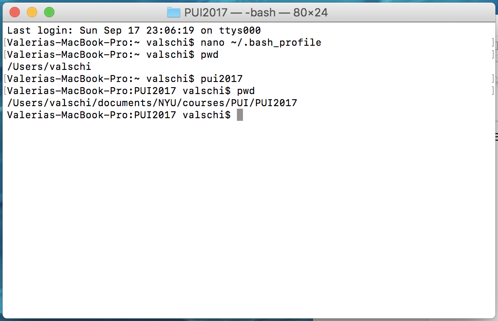

# PUI2017_vjs306  HW1

This is me testing to create a README.md file in my local drive and add / commit / push at the same time as the HW1 folder. _wish me luck_.

This is me again and I am making progress, it took a day, but I am no longer getting awful errors while trying to run git commands in local. The sequence of when to add, commit, push, and pull is much clear now.

I still have to figure out how to treat, and definitely not push, the mac files such as that .DS_Store file that I don't know what it is. 

Below is the SnapShot of my __bash profile__ file:

And following is the snapshot of the alias __pui2017__ in action.

_Valeria_
