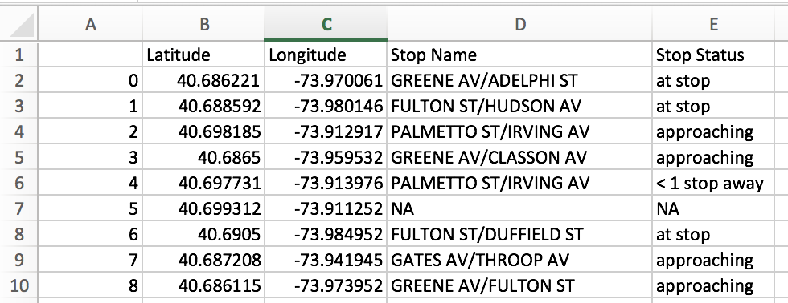

__HW2 README FILE__

Saturday September 23rd
Team: Davey, Matt, Srikanth, Valeria

On Sunday September 24th: Davey and I met again and this time with Tarek and Imran.

On Wednesday: Imran, Srikanth and I met again. (This time John was also in the room but separate table)

___ASSIGNMENT 1___

Saturday we met to work on the Assignments. At the beginning I had a hard time catching up, I was able to understand the assignment but struggled on how to begin. Matt got ahead with the actual lines for getting the url, as well as navigating through it.

At that moment I went back to the class notes in which I saw where Matt was getting the lines and format from.

With Davey we looked at the url directly and discovered that Firefox gives the options of seeing the JSON file already as a tree structure which made it easier to navigate to the proper level of what I called busdata.

__busdata__ = data['Siri']['ServiceDelivery']['VehicleMonitoringDelivery'][0]['VehicleActivity']

Here again when I saw how Matt was doing it it made sense. But I wanted to also try it by myself. I lost a little bit of time, having to go back to the class notes again.

In the end after the basis where set the same, and comparing with Matt and Davey the codes worked with our same level of understanding the requirements and outputs.

We all struggled with how to show the bus number inside the for loop because we wanted to extract the value from the MTA. But Srikanth was the one that suggested a simpler way of achieving the same purpose was to have a counter starting at 0 and to the duration of the loop.

___ASSIGNMENT 2___

For assignment 2 it built exactly from Assignment 1. Looking closer where in the JSON was the info we needed we found the variables the hint on OnwardCalls helped.  Davey figured out that they were different number '0' being the immediate next or current stop, and '1' the one afterwards and so on.

The logic I was able to understand as well as construct the for loop alongside Matt, Davey and Srikanth. It needed to be a dictionary of each of the requested values: _Longitude, Latitude, Stop Name,_ and _Stop Status_ and that going into a list ___datalist___ .

We struggled to understand a scenario on which the OnwardCalls would be empty and entering the _NA_. We were unsure how this will look, would the entire field be empty? Would the content be just blank? Davey and I were looking into the JSON for any such scenario but we couldn't find it. Matt was coding an if/else code assuming a null, then I remembered about handling exceptions in the for loop so I created the exception, we decided to leave at the highest level as we were still not sure what the "empty" data from the MTA would look like.

We all run the code, it ran fine, but we never got any "NA", while the 4 of us were working on it still on Saturday.

For the last portion on how to easily use __Pandas__ to create a DataFrame and from it a _.csv_ there was some teamwork and googling involved.

On Sunday when Davey and I met I ran the code and got some NAs. He ran his and not immediately but after few minutes he also got NA. This was a confirmation to us that our code exception handling was working as intended.

__IMPORTANT NOTE:__

1. As we used __Pandas__ for this _Assignment 2_ please make sure Pandas is installed in the computer running the script.
  a. I discovered this the hard way, on Sunday, when running my script locally I got an error that Pandas was not installed. Actually while "fixing" it I ended up breaking things more to even numpy was not running. I just installed python again following Mohit's directions and was able to continue.

  ___ASSIGNMENT 3___

On Sunday with Davey we were able to navigate throught the Data Facility, it was frustrating because the Data Catalog was, and still is, down, but Davey found that clicking on the Urban Profiler we could find some DataSets. Together we made sense of the structure, for example _/projects/open/NYCOpenData/nycopendata/data/8hkx-uppz/1414245842/8hkx-uppz_. 

Monday I worked on Assignment 3. Davey and I went to the TA hours and while we were there he was having trouble with his environmental variables but I was able to get some code to work. I got a plot that complied with the assignment but didnot produce anything meaningful whatsoever (Monday I worked on Assignment 3. Davey and I went to the TA hours and while we were there he was having trouble with his environmental variables but I was able to get some code to work. I got a plot that complied with the assignment but didnot produce anything meaningful whatsoever (Projected Population 2010-2040 - Total By Age Groups).  I spent then about 40 minutes trying to find a dataset that had more useful information. And that is how I got _New Housing Units per District_

On Wednesday I will work on the Extra Credit if I get a time to complete but I want to have the Assignment 3 uploaded. 

___Extra Credit___

I probably did not choose the best dataset to begin with, but for the sake of practicing I stick to it, at first when I tried to plot using the same code as for Assignment three I got an error with the name of my X variable (License Expiration Date) googling I found that I had to convert the date using pd.to_datetime . Yet my plot was still giving a long error wiht my X variable.  Srikanth confirmed to_datetime was correct, he found another way of plotting using set_index but I wanted to avoid using it. I spent a lot of time and reviewed my code, when I removed the plot.scatter then it worked.

I wanted to use scatter but instead, and following what we did in HW1 I used style "." while plotting. 

The caption method I used before didnt work, I think because the X axis has dates, so I just used a MarkDown cell.  I wish I could have time to find a more meaningful dataset. 

Off now. 

Valeria

