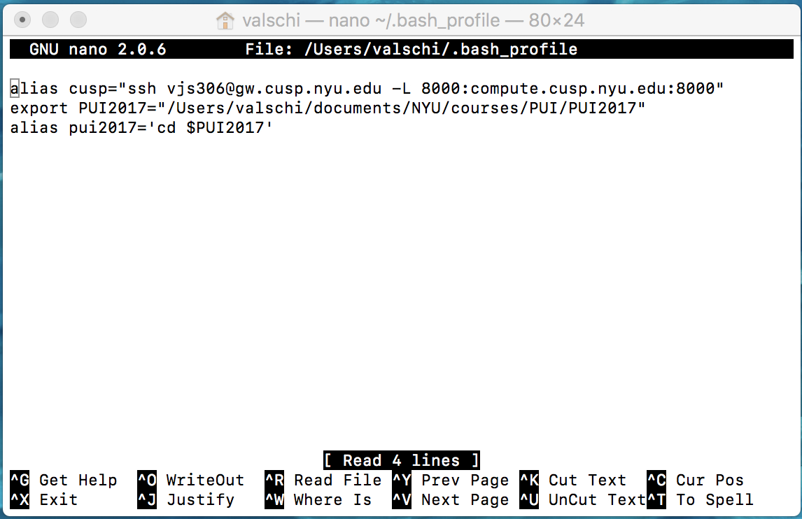

# PUI2017_vjs306

This is my github repository for __PUI2017__.  It took a few tries but I am getting better. 

_Below are the details for HW1 assignment_

During Thursday session I was able to follow along, but not reproduce it on my side as I did not have a github account just yet. 

On Sunday noon several of us (Tarek, Matt, Srikant, Imran, Davey and myself) met to work on the assignment. We all progressed at different speeds but it was very helpful to help and learn from each other, including each other mistakes. 

In particular for __me__ , on Sunday I got as far as to complete the ___Assignment 1___ my repository, the lab, including messing with Davey's, Tarek's and Imran's repositories, we worked kind of in a circle. 

___Assingment 2___ was straight forward to configure my bash profile. It took several hours, mainly because on _Assignment 1_ I kep getting errors after creating the repository, and running the command __git remote add origin__, errors about the branch not existing. After spending some time troubleshooting (google) I assumed I had skipped some commands or followed a wrong order. I deleted the repository, started again and then just copy and pasted both commands and this time around it worked. 

__ASSIGNMENT 2 IMAGES BELOW:__

Below is the SnapShot of my __bash profile__ file:

And following is the snapshot of the alias __pui2017__ in action.

Continuing now on to _Assignment 3:_

On Tuesday evening a subset of the Sunday team met again to continue work on _Assignment 3_ the extra credit. I am to the point that the code is working, but I need to upload to github, as well as pull Federica's file, in order to submit as requested and not just the code lines.  I will update this README file when that part is done.

On Wednesday evening I received feedback from the TA that my folder structure for this particular README and _Assignment 2_ was not correct so I came to fix that before completing the EC.

_Valeria_
